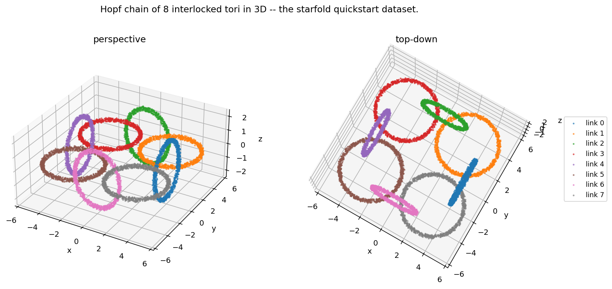
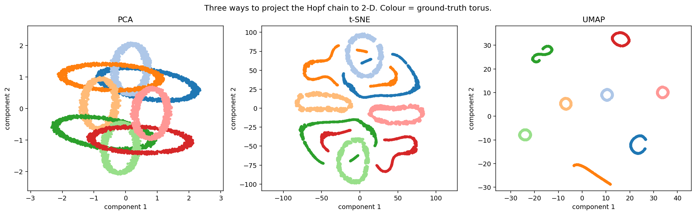
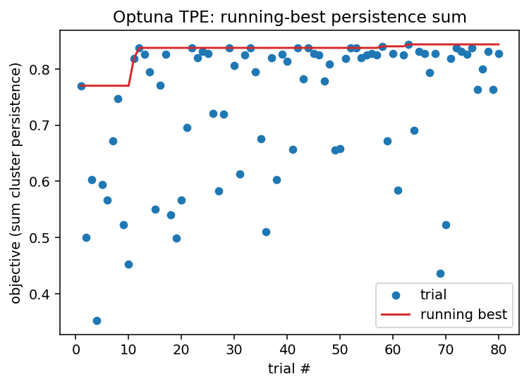
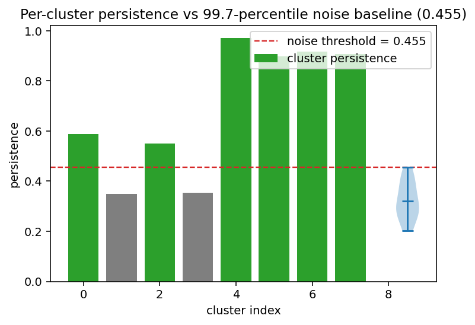
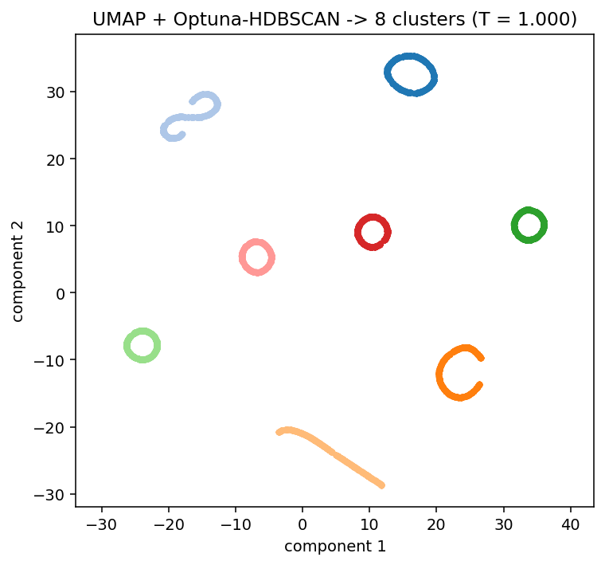
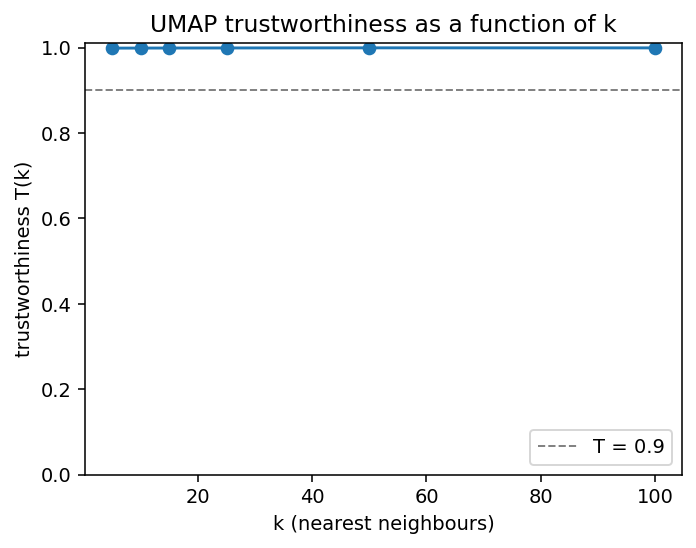
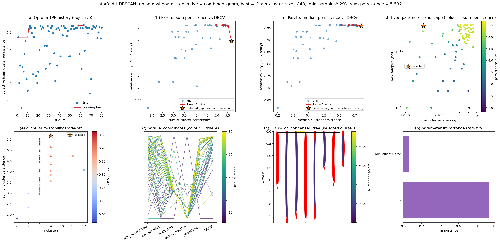
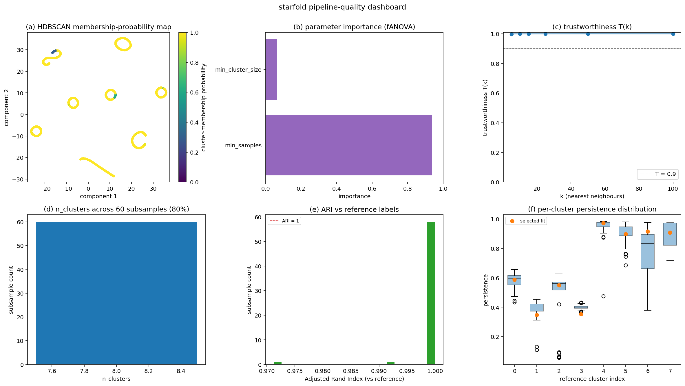

# starfold

A general-purpose unsupervised clustering tool. It applies UMAP manifold
learning followed by Optuna-tuned HDBSCAN clustering, and validates the
output with a trustworthiness score and a statistical noise baseline.
Input is any numerical feature matrix; it is not tied to any domain.

The methodology follows §3 of Neitzel, Campante, Bossini & Miglio (2025),
*Astronomy & Astrophysics* **695**, A243
([arXiv:2501.16294](https://arxiv.org/abs/2501.16294)). Please cite the
paper if you use this tool; see `CITATION.cff`.

---

## At a glance

`starfold`'s quickstart dataset is a closed chain of eight Hopf-linked
tori in 3D -- adjacent tori interlock through each other's central
holes, non-adjacent tori don't. It's a topologically non-trivial point
cloud that exposes what the pipeline does to real structure.



PCA collapses the chain into its 2-D shadow; t-SNE and UMAP unroll the
loops into distinguishable components.



`starfold`'s pipeline then picks HDBSCAN hyperparameters by maximising
the sum of cluster persistences with a TPE-sampled Optuna study.



The final clusters are compared against a 99.7th-percentile
structureless-noise baseline; clusters whose persistence sits above
the threshold are flagged `significant`.



The embedding coloured by HDBSCAN's output, with outliers in grey:



And trustworthiness as a function of *k*, the paper's sanity check on
whether UMAP preserved local structure:



Two single-call dashboards put every diagnostic on one canvas:
`result.plot_tuning_dashboard()` for the HDBSCAN search (Optuna history,
Pareto fronts, hyperparameter landscape, parameter importance, condensed
tree, and granularity-stability trade-off):



...and `result.plot_quality_dashboard(X)` for pipeline quality
(membership-probability map, parameter importance, trustworthiness curve,
and three panels of bootstrap subsample stability):



---

## Install

```bash
pip install starfold
```

For development:

```bash
git clone https://github.com/AndreasWNeitzel/starfold
cd starfold
pip install -e ".[dev]"
```

Python 3.11 or 3.12 is required. Optional GPU acceleration for HDBSCAN
through `cuml` (RAPIDS) is used automatically when importable; CPU is
the default and is always available.

## Quickstart

```python
import numpy as np
import starfold as sf

X = np.random.default_rng(0).normal(size=(3_000, 5))

pipeline = sf.UnsupervisedPipeline(
    umap_kwargs=dict(n_neighbors=15, min_dist=0.0),
    hdbscan_optuna_trials=100,
    random_state=42,
)
result = pipeline.fit(X)

result.embedding            # (n_samples, 2)
result.labels               # (n_samples,) with -1 for outliers
result.persistence          # (n_clusters,)
result.significant          # (n_clusters,) bool, vs noise baseline
result.trustworthiness      # float in [0, 1]
print(result.summary())
sf.plot_embedding(result.embedding, result.labels)

# One-line diagnostic dashboards:
result.plot_tuning_dashboard()      # 8-panel HDBSCAN tuning canvas
result.plot_quality_dashboard(X)    # 6-panel pipeline-quality canvas

result.save("run_01/")
```

The full runnable example lives in [`docs/tutorial_01_quickstart.ipynb`](docs/tutorial_01_quickstart.ipynb).
An optional second tutorial, [`docs/tutorial_02_astronomy_example.ipynb`](docs/tutorial_02_astronomy_example.ipynb),
applies the pipeline to a bundled 9 242-star Milky Way chemo-dynamical sample
(APOGEE DR19 ASPCAP chemistry + `galpy` actions from Gaia DR3 astrometry; shipped as a
~0.5 MB parquet under [`docs/data/`](docs/data/stellar_chemokinematics_apogee_dr19.provenance.md)
so the notebook runs offline).

## What's inside the package

| Module | Purpose |
|---|---|
| `starfold.embedding` | Thin wrappers: `run_umap`, `run_tsne`, `run_pca`. |
| `starfold.trustworthiness` | Venna & Kaski (2001) $T(k)$, cross-tested against `sklearn`. |
| `starfold.clustering` | `run_hdbscan` and `search_hdbscan` (Optuna TPE over MCS/MS). |
| `starfold.noise_baseline` | 99.7th-percentile persistence baseline with on-disk caching. |
| `starfold.pipeline` | `UnsupervisedPipeline` orchestrates all four steps. |
| `starfold.plotting` | `plot_embedding`, `plot_trustworthiness_curve`, and a family of tuning / quality diagnostic panels composable into `PipelineResult.plot_tuning_dashboard` and `plot_quality_dashboard`. |
| `starfold.io` | `PipelineResult.save` / `load_pipeline_result`. |

See [`docs/methodology.md`](docs/methodology.md) for the paper §3
walkthrough and [`docs/design_decisions.md`](docs/design_decisions.md)
for every place where the paper is silent and `starfold` picks a
default.

## Scope

This package implements the methodology of Neitzel et al. (2025), not
the paper's scientific application. It does not construct stellar
samples, model observational uncertainties, apply survey selection
functions, or know anything about galactic archaeology. A biologist
clustering single-cell RNA-seq data should find the tool as usable as
an astronomer clustering stars.

## License

MIT. See `LICENSE`.
