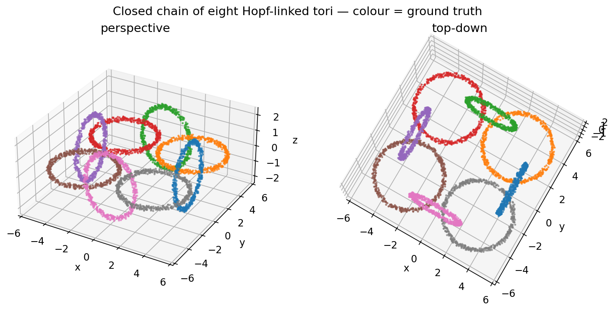
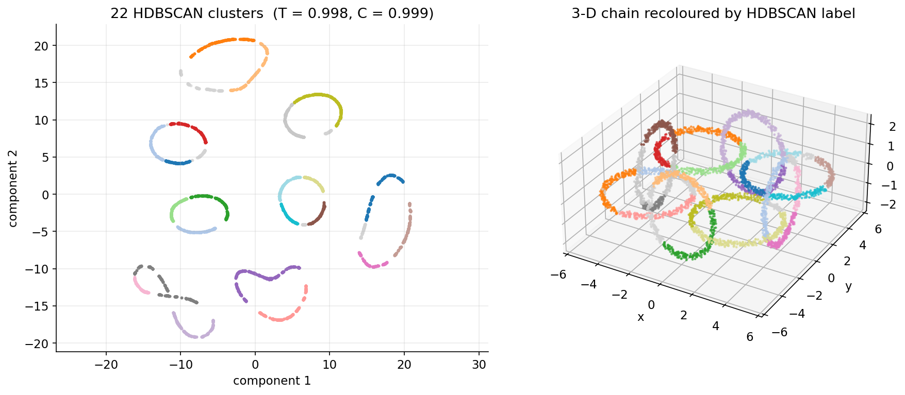
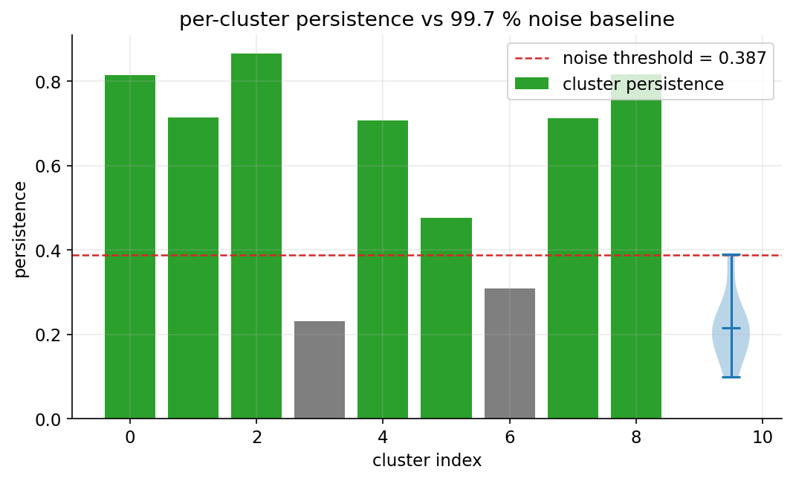
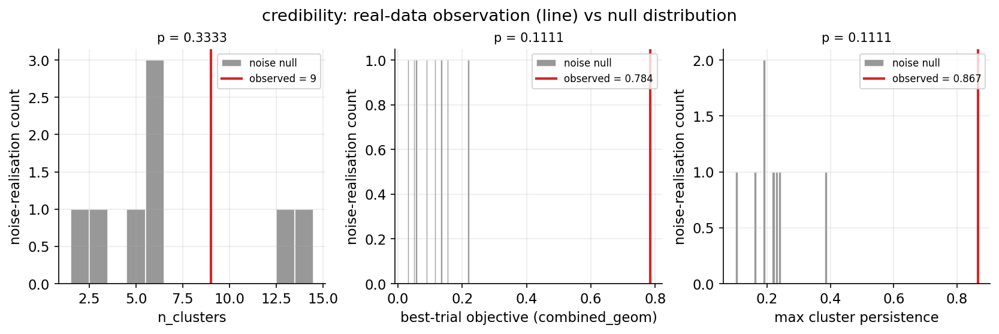
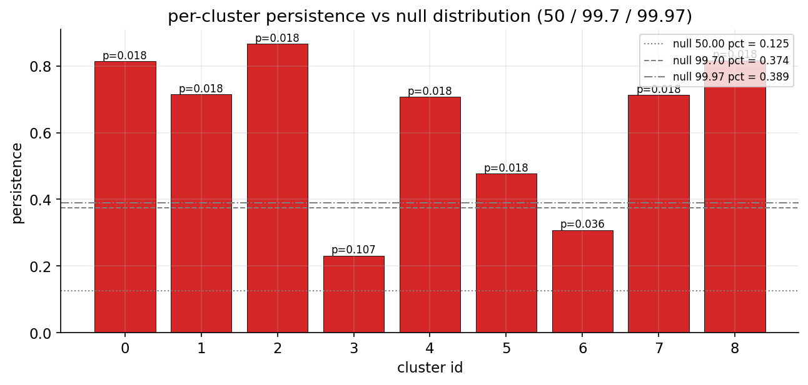
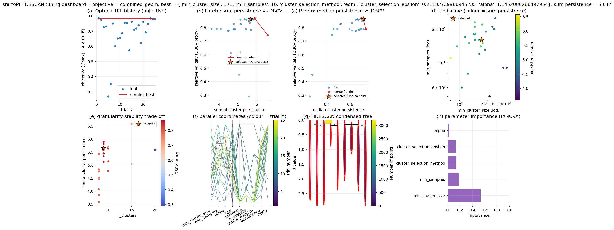
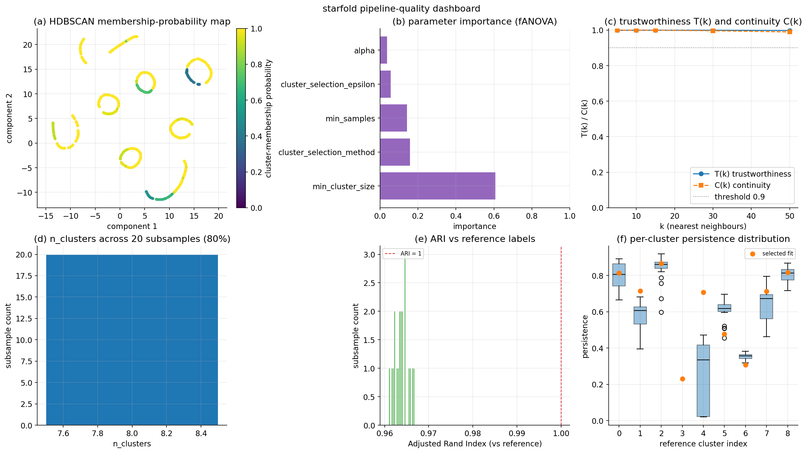
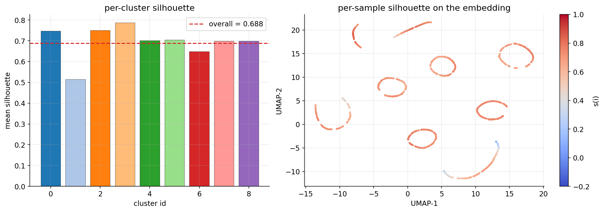
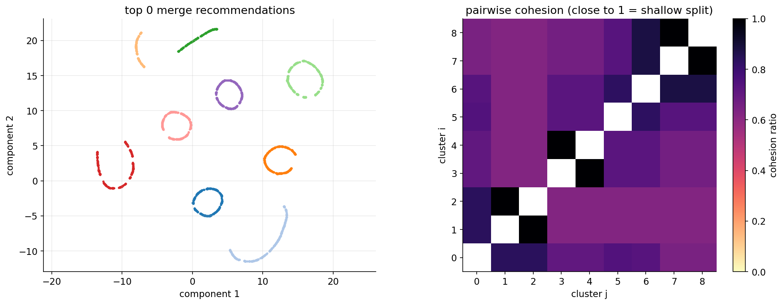
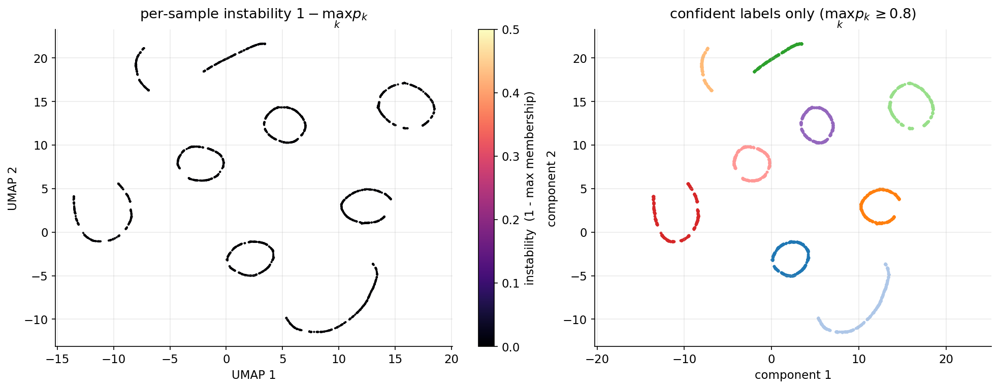

# starfold

[](https://github.com/AndreasWNeitzel/starfold/actions/workflows/ci.yml)
[](https://www.python.org/downloads/)
[](LICENSE)
[](https://arxiv.org/abs/2501.16294)

A general-purpose unsupervised clustering tool. It applies UMAP manifold
learning followed by Optuna-tuned HDBSCAN clustering, and validates the
output with a trustworthiness score and a statistical noise baseline.
Input is any numerical feature matrix; it is not tied to any domain.

The methodology follows §3 of Neitzel, Campante, Bossini & Miglio (2025),
*Astronomy & Astrophysics* **695**, A243
([arXiv:2501.16294](https://arxiv.org/abs/2501.16294)). Please cite the
paper if you use this tool; see `CITATION.cff`.

---

## At a glance

`starfold`'s quickstart dataset is a closed chain of eight Hopf-linked
tori in 3D — adjacent tori interlock through each other's central
holes, non-adjacent tori don't. It is a topologically non-trivial
point cloud that exposes what the pipeline does to real structure.



One call (`pipeline.fit(X)`) standardises the features, learns a 2-D
UMAP embedding, tunes HDBSCAN with an Optuna TPE sampler, and scores
the result with trustworthiness and continuity:



The final clusters are compared against a 99.7th-percentile
structureless-noise baseline; clusters whose persistence sits above
the threshold are flagged `significant`:



Because HDBSCAN returns at least two clusters even on pure noise,
`starfold` also runs a global **credibility test**: three
per-realisation scalars (cluster count, best Optuna objective,
strongest persistence) are compared against their noise nulls with
empirical upper-tail p-values, and the run "passes" at 3σ when all
three clear `alpha`. Every real-data cluster is *also* given a
per-cluster p-value against the pool of every noise cluster's
persistence across every realisation:





Two single-call dashboards put every diagnostic on one canvas:
`result.plot_tuning_dashboard()` audits the Optuna search —



— and `result.plot_quality_dashboard(X)` audits the result's
stability under subsampling:



When the clustering looks trustworthy, a refinement toolkit takes
over. `chunked_silhouette` computes `sklearn`'s silhouette score
without ever materialising an `N × N` distance matrix;
`suggest_merges` flags cluster pairs that density *and* embedding
geometry agree should be one:





When samples carry per-feature 1σ error bars, starfold offers two
complementary tools.  `result.propagate_uncertainty(X, sigma=...)`
freezes the clean fit and asks "how confident is each sample's
assignment under its error cloud?":



`pipeline.fit_with_uncertainty(X, sigma=..., n_replicas=10)` is the
uncertainty-aware *fit*: the pipeline sees an augmented matrix of
the clean samples stacked with Gaussian replicas, so UMAP and
HDBSCAN adapt their manifold and density estimates to the error
bars rather than ignoring them.

`sigma` accepts a scalar, a per-feature vector, or a
per-sample-per-feature matrix;
`plot_uncertainty_map(result.embedding, propagation)` colours the
embedding by instability.

---

## Install

```bash
pip install starfold
```

For development:

```bash
git clone https://github.com/AndreasWNeitzel/starfold
cd starfold
pip install -e ".[dev]"
```

Python 3.11 or 3.12 is required. Optional GPU acceleration through
`cuml` (RAPIDS) is used automatically when importable; CPU is the
default and is always available.

## Quickstart

```python
import numpy as np
import starfold as sf

X = np.random.default_rng(0).normal(size=(3_000, 5))

pipeline = sf.UnsupervisedPipeline(
    umap_kwargs=dict(n_neighbors=15, min_dist=0.0),
    hdbscan_optuna_trials=100,
    random_state=42,
)
result = pipeline.fit(X)

result.embedding            # (n_samples, 2)
result.labels               # (n_samples,) with -1 for outliers
result.persistence          # (n_clusters,)
result.significant          # (n_clusters,) bool, vs noise baseline
result.credibility          # CredibilityReport, or None if noise baseline was skipped
result.trustworthiness      # float in [0, 1]
result.flags                # list[str] — diagnostic warnings, empty on a healthy fit
print(result.summary())     # flags surface at the top so they cannot be missed
sf.plot_embedding(result.embedding, result.labels)

# One-line diagnostic dashboards:
result.plot_tuning_dashboard()      # 8-panel HDBSCAN tuning canvas
result.plot_quality_dashboard(X)    # 6-panel pipeline-quality canvas

# Two-run "zoom in on a cluster" pattern:
sub = result.refit_subcluster(X, cluster_id=0)

# Sample-size-aware budget suggestion:
sf.recommend_budget(n_samples=X.shape[0])   # -> {"hdbscan_optuna_trials": ..., ...}

result.save("run_01/")
```

## Tutorials

Four short, focused notebooks under `docs/`:

| # | Notebook | What it covers |
|---|---|---|
| 1 | [`tutorial_01_quickstart.ipynb`](docs/tutorial_01_quickstart.ipynb) | 30-second story: fit the pipeline, read the summary, look at the embedding. Synthetic torus chain. |
| 2 | [`tutorial_02_validation.ipynb`](docs/tutorial_02_validation.ipynb) | Noise baseline, 3σ credibility test, tuning and quality dashboards. |
| 3 | [`tutorial_03_advanced.ipynb`](docs/tutorial_03_advanced.ipynb) | Chunked silhouette, merge recommender, sub-cluster refit, uncertainty propagation, uncertainty-aware fit. |
| 4 | [`tutorial_04_astronomy.ipynb`](docs/tutorial_04_astronomy.ipynb) | Real-data case study: 9 242 Milky Way stars from APOGEE DR19 + Gaia DR3 orbital actions (bundled parquet, no survey download at runtime). |

The data for tutorial 4 ships as a ~0.5 MB parquet under
[`docs/data/`](docs/data/stellar_chemokinematics_apogee_dr19.provenance.md)
so the notebook runs offline.

## What's inside the package

| Module | Purpose |
|---|---|
| `starfold.embedding` | Thin wrappers: `run_umap`, `run_tsne`, `run_pca`. |
| `starfold.trustworthiness` | Venna & Kaski (2001) $T(k)$, cross-tested against `sklearn`. |
| `starfold.clustering` | `run_hdbscan` and `search_hdbscan` (Optuna TPE over MCS/MS). |
| `starfold.noise_baseline` | 99.7th-percentile persistence baseline with on-disk caching. |
| `starfold.credibility` | Global 3σ credibility test and per-cluster p-values vs the noise null (`compute_credibility`, `CredibilityReport`). |
| `starfold.uncertainty` | Input-uncertainty propagation *and* uncertainty-aware fitting: `propagate_uncertainty` / `UncertaintyPropagation` freeze a clean fit and Monte Carlo perturbations against it, while `UnsupervisedPipeline.fit_with_uncertainty` feeds an augmented replica matrix through the full pipeline and returns an `UncertaintyAwareFit`. |
| `starfold.diagnostics` | Input validation (`validate_input_matrix`), fit diagnostics surfaced in `PipelineResult.flags` (`diagnose_fit`), data-size-aware defaults (`auto_mcs_upper`, `recommend_budget`). |
| `starfold.pipeline` | `UnsupervisedPipeline` orchestrates all four steps. |
| `starfold.plotting` | `plot_embedding`, `plot_trustworthiness_curve`, and a family of tuning / quality diagnostic panels composable into `PipelineResult.plot_tuning_dashboard` and `plot_quality_dashboard`. |
| `starfold.io` | `PipelineResult.save` / `load_pipeline_result`. |

See [`docs/methodology.md`](docs/methodology.md) for the paper §3
walkthrough and [`docs/design_decisions.md`](docs/design_decisions.md)
for every place where the paper is silent and `starfold` picks a
default.

## Caching

`compute_noise_baseline` memoises the 99.7th-percentile threshold
under `platformdirs.user_cache_dir("starfold")` (typically
`~/.cache/starfold` on Linux). The cache key is a hash of
`(n_samples, n_features, frozen umap_kwargs, random_state,
n_realisations, per_realisation_trials)`. Clear it by deleting the
directory or by passing `force_recompute=True` on the call that
provoked it. The pipeline surfaces the same option through
`UnsupervisedPipeline(noise_baseline_kwargs={"force_recompute":
True})`. The cache is ignored by git.

## Scope

This package implements the methodology of Neitzel et al. (2025), not
the paper's scientific application. It does not construct stellar
samples, model observational uncertainties, apply survey selection
functions, or know anything about galactic archaeology. A biologist
clustering single-cell RNA-seq data should find the tool as usable as
an astronomer clustering stars.

## License

MIT. See `LICENSE`.
